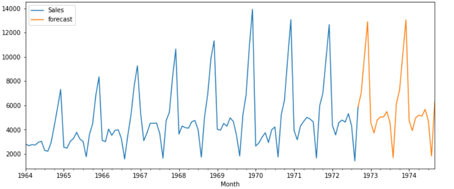

# Perrin Freres Time Series Analysis

Time series analysis on the monthly sales data of Perrin Freres is done.  
Model used - SARIMAX (Seasonal Auto Regressive Intergrated Moving Average with Exogenous Factors)  
Dataset link - <a href="https://www.kaggle.com/datasets/anupamshah/perrin-freres-monthly-champagne-sales">https://www.kaggle.com/datasets/anupamshah/perrin-freres-monthly-champagne-sales</a>

